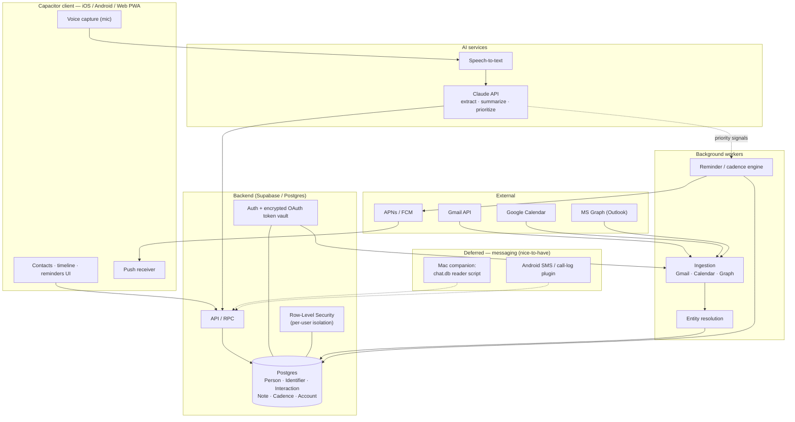

# Architecture

Personal-first PRM (personal relationship management tool), designed so a single-user build and an eventual multi-user release share the same schema — no rework needed to go from "just me" to "a few private users."

## System shape

## Components

### Capacitor client
One codebase → web + iOS + Android. Pure display-and-forms over the API — no native code needed for the core app. Off-the-shelf plugins cover the two things that need the device: native push (reliable reminder delivery — iOS web-push for PWAs is second-class) and mic capture for voice notes.

### Backend — Supabase / Postgres
Managed Postgres + Auth + storage + row-level security in one box. RLS is the reason to pick it: per-user data isolation is close to free, so "personal tool" and "multi-tenant SaaS" end up being the same schema. Encrypted OAuth token vault (pgsodium / Vault) holds third-party tokens server-side, never on the client.

**Caveat worth remembering:** this app is server-heavy (ingestion workers, a token vault, webhooks, cadence jobs). Most of Supabase's headline value (PostgREST + client-side RLS) is built for thin-backend apps; here the backend largely uses the service-role key and bypasses that pattern. So for this project, Supabase mostly reduces to *managed Postgres + auth + hosting + storage* — still worth it to skip the auth/hosting yak-shaving, just don't expect it to shrink the ingestion-OAuth work (see below).

**Free tier reality:** 500 MB DB, 5 GB egress/month, 50k MAU, projects pause after 1 week idle — fine for solo/dev use, not a scale-with-userbase tier. Pro ($25/mo → 8 GB DB, 250 GB egress, 100k MAU) is the realistic baseline the moment this has real active users. At personal/early scale this cost is noise either way.

### Background workers
- **Ingestion** — Gmail + Google Calendar (+ MS Graph for Outlook) via webhook/push where available, cron polling as v1 fallback. Pulls metadata (who/when/subject), not full bodies unless needed.
- **Entity resolution** — the differentiating core. Deterministic first (email, then phone), fuzzy name matching second. Produces one canonical `Person` with many `Identifier`s.
- **Reminder / cadence engine** — scheduled job computing "overdue" per contact against a target frequency, firing push. This is what makes it a PRM rather than an address book.

### AI services
Claude API for: extracting structured fields from voice notes, summarizing threads for the timeline, ranking who-to-reach-out-to for the reminder engine. STT (Deepgram Nova-3 class) transcribes voice before extraction — batch mode (~$0.0043/min) is the right default for note capture; streaming (~$0.0077/min) is a UX polish item, not a v1 need.

### Deferred — messaging (nice-to-have only)
- **iMessage**: `~/Library/Messages/chat.db` on a Mac, readable by a plain Node/Python script with Full Disk Access — no Xcode or native dev needed. Both Dex and Mesh (formerly Clay) already do this via full-disk-access, and it's a recurring privacy complaint in reviews — worth a lighter-touch approach if built.
- **Android SMS/call-log**: needs a genuine native Capacitor plugin (`READ_SMS`/`READ_CALL_LOG`) and hits a Google Play policy wall for anything beyond personal sideloaded use.
- **iOS SMS/call-log**: no API exists at all — an OS wall, not a skill-level barrier.

## OAuth — two different problems, only one solved by Supabase
- **Login OAuth** ("Sign in with Google/Microsoft/Apple") — Supabase Auth handles this natively for all three.
- **Data-access OAuth** (a token scoped to read Gmail/Calendar in the background for ingestion) — Supabase does *not* persist/auto-refresh this. The encrypted token vault + refresh flow is work regardless of backend choice.
- **Apple Calendar**: "Sign in with Apple" is identity-only, grants no calendar access. Apple has no cloud Calendar API — iCloud calendars require CalDAV (clunky, app-specific password) or EventKit inside a native iOS app. Much of what looks like "Apple Calendar" is actually a Google/Exchange account synced into it, already covered by the Google/MS integrations — treat true iCloud-native calendar support as deferred, not v1.
- **Google scopes**: Gmail/Calendar restricted scopes require a Google security assessment (CASA) before general availability — budget for this before public launch, independent of any other stack choice.

## AI cost model (per active user / month)

Design principle: metadata ingestion (who/when/subject matching, entity resolution) uses no LLM and is free. AI cost is only voice extraction, thread summarization, and the periodic digest — priced with Haiku doing the bulk of the work and Sonnet reserved for the digest.

| Component | Moderate user | Heavy user |
|---|---|---|
| Voice STT + extraction | ~$0.13 | ~$0.5 |
| Thread summarization (Haiku, summarize once, cache) | ~$0.23 | ~$1 |
| Prioritization digest (Sonnet, weekly/daily) | ~$0.07 | ~$0.3 |
| **Total AI COGS** | **~$0.40–0.50** | **~$1.50–2.00** |

At a $15–25 subscription (if this ever monetizes), AI COGS is ~2% of revenue — payment processing (~2.9%+$0.30) is actually the larger per-user cost. The lever that matters: summarize each thread once and store it, never re-summarize on view; naive re-summarization on every render can push heavy-user AI cost to $5–8/month.

## Core data model

| Entity | Purpose | Key fields |
|---|---|---|
| **Account** | A connected source | provider, encrypted tokens, owner |
| **Person** | Canonical human | name, tags, notes, personal details |
| **Identifier** | Handles resolving to a Person | type (email/phone/handle), value → person_id |
| **Interaction** | One touchpoint (auto or manual) | source, direction, ts, summary |
| **InteractionPerson** | Join table — an Interaction can involve more than one Person | interaction_id, person_id |
| **Note** | Free/voice-captured context | text, source = voice/manual |
| **Cadence** | Desired contact frequency | interval, last_contact, next_due |

`InteractionPerson` is a join table, not a `person_id` FK directly on `Interaction` — required because a single voice capture can name multiple people (see `capture-flow.md`). Build this from the start; retrofitting onto a populated table is the kind of migration worth avoiding.

## Build order

1. Backend spine: auth, encrypted token vault, schema with RLS from day one.
2. Gmail + Calendar ingestion + entity resolution — this alone is already a working, self-updating PRM.
3. Cadence engine + native push.
4. Capacitor client UI across web/iOS/Android.
5. Voice capture (see `capture-flow.md` for the detailed design) — once daily-use is proven.
6. Messaging — only if it earns it; iMessage script first, Android plugin last, both deferred.

## Explicitly out of scope for now
Social sources (LinkedIn/X), messaging ingestion, team/sharing features, native app beyond the Capacitor shell, real-time voice agent / conversational query interface (cost structure — ~$4.50/hr for live voice agent APIs — doesn't fit a flat low-price plan, and browsing/reviewing contacts is inherently visual, not voice-native). Each of these is additive on the current schema, not a rewrite, if revisited later.
