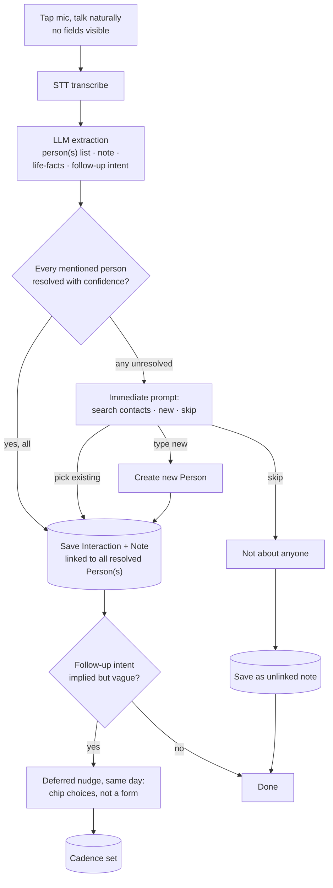

# Guided Voice Capture Flow

Personal-first design. Entity resolution and completeness rules are scoped per authenticated user (via RLS) by construction, so this needs no rework for eventual multi-user release.

## Governing rule

Capture is always zero-friction — with one exception. **Interrupt immediately whenever person attribution can't be resolved with confidence**, whether that's an ambiguous match ("which Sarah?") or no identifiable person at all. Both are the one class of error that can't be fixed gracefully later — a note filed under the wrong person, or never filed anywhere, silently corrupts or loses the record. Everything else — vague follow-up timing, missing life-facts — is deferred to an optional, tap-to-dismiss nudge afterward.

## The flow

If more than one mentioned person is unresolved in the same capture (both "Sarah" and "Mike" ambiguous), they resolve one at a time through the same immediate prompt — a short sequence, not a combined form.

## What "complete" means — and what it deliberately doesn't

A personal contact note carries almost none of the compliance pressure a business report would. Over-specifying required fields recreates the "bloated CRM" complaint the category already has (see `competitive-brief.md`). The rule set is intentionally thin — really one soft rule.

| Element | Status | Why |
|---|---|---|
| Person attribution | **Hard-required**, resolved immediately | Everything else hangs off the right `Person`. Get this wrong and the timeline lies. |
| Raw note / summary | Always captured, no check needed | It's just the transcript — nothing to be "incomplete." |
| Life-facts (job change, family, etc.) | Best-effort extraction, never gated | Nice-to-have enrichment; missing one isn't worth interrupting for. |
| Follow-up date / cadence | **Soft-required**, only if intent implied | The one thing worth a nudge — an implied "let's stay in touch" that never becomes a reminder is the exact failure mode a PRM exists to prevent. |

**Example:** *"grabbed coffee with Sarah, she's leaving Acme, let's catch up again soon"* → person resolved, note saved, life-fact (job change) extracted — all silent. "Soon" is vague, so a same-day nudge offers 1 week / 1 month / 3 months / pick a date, one tap, done.

## Edge cases — resolved

### Multiple people in one capture
*"Grabbed lunch with Sarah and Mike"* — one shared `Interaction`, linked to every mentioned `Person` via the `InteractionPerson` join table (not a single `person_id` foreign key). Both timelines show the same entry, no duplicated text to drift out of sync. If a follow-up is implied, the deferred nudge defaults to applying it to everyone linked, with a one-tap option to narrow it to just one person.

### No identifiable person
Prompted immediately, before saving — "who's this about?" — rather than deferred, since an unfiled or misfiled note is worse than a brief interruption. This is the second case the governing rule above covers.

> **Flagged addition, not user-specified:** a one-tap "skip — not about anyone" option is kept inside that same prompt, so a stray memo (a reminder to buy milk, a random idea) doesn't get forced onto the nearest name just because the app insists on a person. Revisit if every capture should instead require a person.

### Correcting a misheard name
Tap the person on any note → search-as-you-type over existing contacts to reassign, with a freeform fallback to create a new `Person` if it wasn't a mishearing but someone not yet tracked. Because interactions can link to multiple people, this same control needs to support adding/removing people from a shared interaction, not just swapping one name — a direct extension of the multi-person decision above, not a separate feature.

## The payoff this earns

The guided layer isn't valuable because the data is "more complete" in the abstract — it's valuable because it's the difference between a reminder that actually fires and one that silently never gets set. If a "draft a reconnect message" feature is built later (echoing Dex's AI thank-you notes, but automatic rather than prompt-driven — see `competitive-brief.md`), this capture path is what makes that draft trustworthy instead of guesswork.

## Data model impact

One real schema change from the original architecture sketch: an `Interaction` can no longer assume a single `Person`. It needs the `InteractionPerson` join table (`interaction_id`, `person_id`) rather than a `person_id` foreign key directly on `Interaction` — make this change now, before any data exists, rather than migrating a populated table later.

Otherwise unchanged: capture writes an `Interaction` (source = voice) and a `Note`; a detected-but-vague follow-up writes or updates a `Cadence` once the nudge is answered. Because `Person`/`Identifier` resolution and the completeness check both already scope to the authenticated user via RLS, this flow needs no rework to support a second user later — the only thing that changes at general-release time is that more than one user's people live in the same tables, which the schema already assumes.
